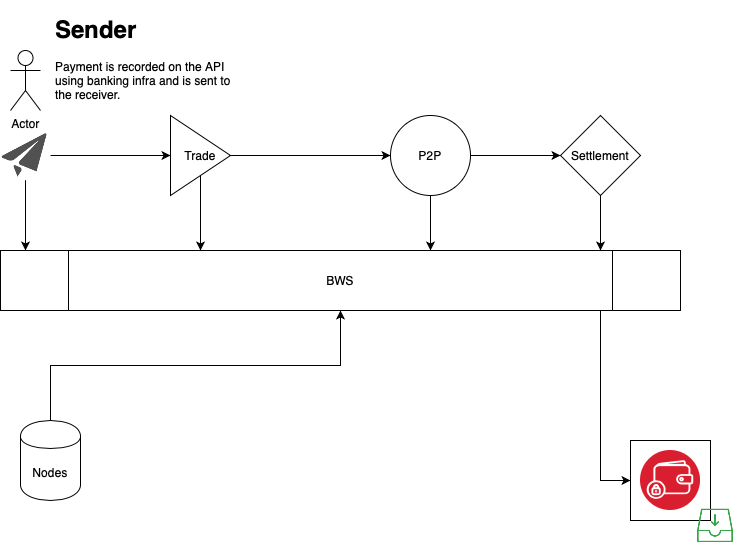

# What is LTCIM

Unbiased  funds raising for the crisis that is going on, covid-19 has struck humanity, Liqudity to crisis in motion refers to fund allocation and resource management for the communities facing crisis. 

Livelihood is at stake due to COVID-19, social interaction has come to standstill where the low strata is in the need for basic food , quality life with access to basic needs. 

This cause is achieved using Cryptographic ledgers and zero trust protocol. These protcols put in place using technology that provides.

- Identity and Reputation 
- Fund provisioning 
- Allocation of funds and resources 
- Multi-Signature wallet system management 
- Fundraising management

This helps an individual to raise funds using this platform in this crisis for communities. Come and collaborate we have started off.

## Standard User Process

A sender pays amount using the send API , the money gets traded over the platform and all the data related to that will be observed and stored once that setllement and thus that currency dervied in INR will be settled.

## Process Flow For Communities

Non profits and communities use this process:

- Adds user (First user creates the first account)
- Users gets verified 
- Payment channels is opened for funding.

